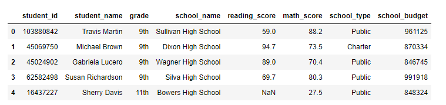
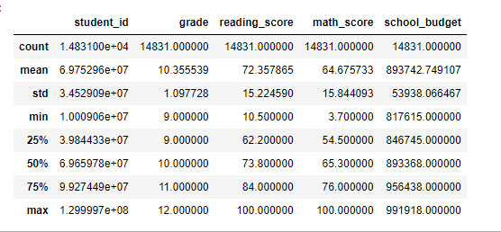
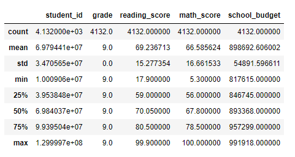
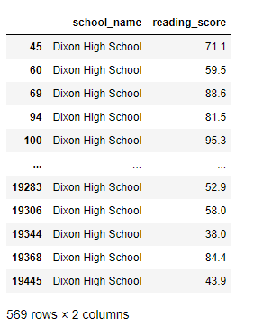
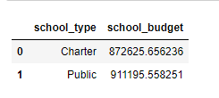
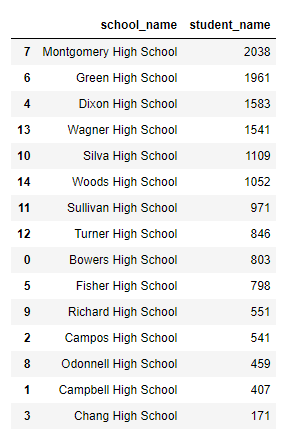
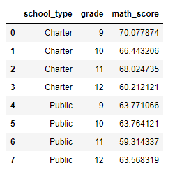

# School District Analysis

*The main goal of this project was to assist Maria, the chief data scientist for a city school district. This analysis is intended to develo insights that are used to inform discussions and strategic decisions at the school and district level.* 

-Deliverable 1: Collect the student data into a DataFrame.

-Deliverable 2: Prepare a cleaned version of the DataFrame.

-Deliverable 3: Summarize key pieces of the data.

-Deliverable 4: Drill down into the data to analyze specific subsets.

-Deliverable 5: Compare and contrast the data through grouping and aggregation functions.

-Deliverable 6: A written analysis of the results.

## Resources

1. Python version 3.6.8
2. Jupiter Notebook 6.5.2
3. Anaconda 2.3.1
4. PythonData enviroment

# Results

## 1. Collect the Data

### Python Code

```
# Create the path and import the data
full_student_data = os.path.join('../Resources/new_full_student_data.csv')
student_df = pd.read_csv(full_student_data)

# Verify that the data was properly imported
student_df.head()
```


## 2. Prepare the Data

### Python Code

```
# Check for null values
student_df.isna().sum()

# Drop rows with null values and verify removal
student_df = student_df.dropna()
student_df.isna().sum()

# Check for duplicated rows
student_df.duplicated().sum()

# Drop duplicated rows and verify removal
student_df = student_df.drop_duplicates()
student_df.duplicated().sum()

# Check data types
student_df.dtypes

# Examine the grade column to understand why it is not an int
student_df['grade']

# Remove the non-numeric characters and verify the contents of the column
student_df['grade'] = student_df['grade'].str.replace('th', '')
student_df['grade']

# Change the grade column to the int type and verify column types
student_df['grade'] = student_df['grade'].astype(int)
student_df.dtypes

```
## 3. Summarize the Data

### Python Code

```
# Display summary statistics for the DataFrame
student_df.describe()
```



### Python Code

```
# Display the mean math score using the mean function
mean_math_score = student_df['math_score'].mean()
mean_math_score

min_reading_score = student_df['reading_score'].min()
min_reading_score
```

## 4. Drill down into the data to analyze specific subsets.


### Python Code

```
# Use loc to display the grade column
student_df.loc[:, ["grade"]]

# Use `iloc` to display the first 3 rows and columns 3, 4, and 5.
student_df.iloc[0:3, [3,4,5]]

# Select the rows for grade nine and display their summary statistics using `loc` and `describe`.
grade_nine_df = student_df.loc[student_df["grade"] == 9]
grade_nine_df.describe()
```


```
min_reading_score = student_df["reading_score"].min()
min_reading_row = student_df.loc[student_df["reading_score"] == min_reading_score]
min_reading_row

# Use loc with conditionals to select all reading scores from 10th graders at Dixon High School.
dixon_reading_df = student_df.loc[(student_df["school_name"] == "Dixon High School") & (student_df["grade"] == 10) & (student_df["reading_score"]), ["school_name", "reading_score"]]
dixon_reading_df

# Find the mean reading score for all students in grades 11 and 12 combined.
student_df.loc[student_df.grade >= 11 , "reading_score"].mean()
```


## 5. Compare and contrast the data through grouping and aggregation functions.

### Python Code

```
# Use groupby and mean to display the average budget for each school.

school_budget_df = student_df.groupby(["school_type"], as_index=False)["school_budget"].mean()
school_budget_df

# Use the `groupby`, `count`, and `sort_values` functions to find the
# total number of students at each school and sort from most students to least students.

student_total_df = student_df.groupby(["school_name"], as_index=False)["student_name"].count()
student_total_df.sort_values(by= 'student_name', ascending=False)

# Find the average math score by grade for each school type by using the groupby and mean functions

student_df.groupby(["school_type", "grade"], as_index=False)["math_score"].mean()
```





## 6. Written Analysis

- The data frame has a total of 14831 students in grades nine through twelve.
- Overall, the average reading score (72.36) for all students is higher than the average math score (64.68).
- Grade 9 has an average reading score of 69.24 and an average math scores of 66.59
- Public schools have a higher budget compared to charter schools. However, charter school students have higher math scores than public schools.
- Montgomery High School is the school with the largest student body consisting of 2,038 students compared to Chang High School, which has 171 students. 


